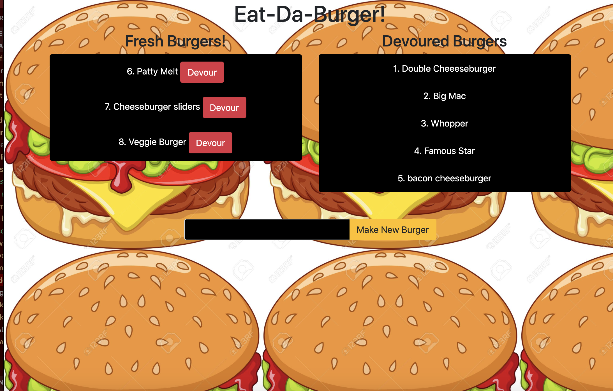

  # Eat-Da-Burger
  ## Description 
  I created a burger app where you can make a new burger, see the available burgers, and devour them. 
  ## Table of Contents 
  * [Installation](#installation) 
  * [Usage](#usage) 
  * [Example](#example)
  ## Installation
  You first need to run npm install to install all the dependencies, then start the server by running node server.js. My app is set to localhost 8000.
  ## Usage
  Once the app is running, it will show you all of the burgers available. There is also an option to make a burger by typing in the burger name, and clicking the make new burger button. Once the devoured button is clicked, the burger will move to the devoured burgers side.
  ## Example
  
   
  